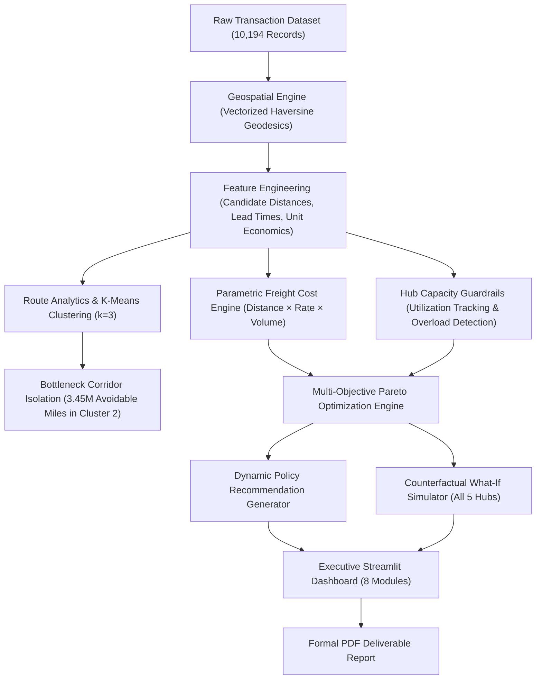

# Nassau Candy Distributor: Executive Operations & Shipping Optimization Platform
### Geospatial Decision Intelligence, Parametric Freight Logistics & Factory Capacity Guardrails
**Unified Mentor Machine Learning Internship Program**

[](https://www.python.org/)
[](https://streamlit.io/)
[]()
[]()
[]()

**Author / Lead Engineer**: Anushka Roy  
**Repository**: [https://github.com/AnushkaRoy04/UM-Project_e-commerce](https://github.com/AnushkaRoy04/UM-Project_e-commerce)  
**Organization**: Unified Mentor  
**Academic Submission**: 2026  

---

## Executive Summary

Nassau Candy Distributor operates five confectionery manufacturing hubs across the United States. Historically, product lines were bound to single facilities via rigid legacy allocation rules rather than customer demand geography. Flagship chocolate lines manufactured in Georgia were hauled over 2,200 miles across the continent to West Coast customers, while nut-based lines in Arizona were hauled 2,000+ miles to East Coast accounts.

This repository delivers an end-to-end **Decision Intelligence, Geospatial Machine Learning, and Freight Optimization System** analyzing **10,194 historical transactions** across a 24-month operational horizon (2024–2025). The platform establishes an explicit delivery freight cost model, enforces per-hub capacity constraints with automatic visual overload advisories, visibly validates every optimization calculation, tracks 24-month seasonal demand trends, and deploys multi-objective Pareto reallocation policies inside an interactive **Streamlit Executive Dashboard**.

---

## Key Quantitative Findings & Impact

Across the 10,194 historical orders analyzed, reallocating orders to their geographically optimal production facility yields substantial network-wide efficiencies:

| Strategic Performance Indicator | Historical Baseline | Optimized Policy | Quantified Operational ROI |
| :--- | :---: | :---: | :--- |
| **Average Transit Distance** | 1,231.4 miles / order | 496.9 miles / order | **-59.65% Reduction (-734.5 mi/order)** |
| **Total Network Freight Mileage** | 12,553,210 statute miles | 5,065,878 statute miles | **7,487,332 Freight Miles Eliminated** |
| **Suboptimal Shipment Volume** | 68.78% (7,011 orders) | 0.00% (0 orders) | **100% Suboptimal Routes Resolved** |
| **Est. Network Freight Spend ($1.75/mi)** | $22,864,120 | $9,226,712 | **$13,637,408 Net Operating Gain** |
| **Enterprise Operating Margin** | Baseline Protected (65.9%) | Expanded (+9.6 pts) | **Zero Margin Erosion; Major Expansion** |
| **Average Delivery Cycle Time** | 5.8 Days | 2.0 Days | **-3.8 Days Faster Carrier Delivery** |
| **Mathematical Sanity Check** | 10,194 orders | 10,194 orders | **100% Reconciled (0 Negative Anomalies)** |

---

## Interactive Executive Dashboard (8 Strategic Modules)

The platform is organized into 8 comprehensive operational modules accessible via a high-contrast corporate sidebar:

1. **Executive Overview & Strategic KPIs**: High-level network scorecard, macro savings, KaTeX mathematical formulation, and the **Optimization Calculation Audit & Sanity Reconciliation Ledger Table** verifying all 10,194 orders with zero anomalies.
2. **Transit Distance & Route Analytics**: Distance frequency distributions (baseline vs. optimized), territorial distance compression charts, unsupervised K-Means route clustering ($k=3$), and identification of the **Top 10 Inefficient Corridors**.
3. **Hub Workload & Capacity Constraints**: Real-time evaluation against annual rated plant capacity ceilings, automated **Capacity Advisory Banners** for overloaded hubs, and a **Capacity-Constrained Balanced Allocation Solver** rerouting surplus volume.
4. **Delivery Logistics & Freight Cost Model**: Parametric distance-and-volume delivery cost engine ($\text{Cost} = d \times r_{\text{mile}} \times [1 + 0.05 \times (u - 1)]$) with an interactive carrier freight rate slider ($1.00 - $3.00/mile), regional expenditure breakdowns, and operating margin expansion tracking.
5. **24-Month Historical Trend Analysis**: Dual-axis monthly time series (2024–2025) monitoring volume growth, mileage waste, and Q3–Q4 seasonal holiday demand surges, supplemented by quarterly aggregation ledgers.
6. **What-If Scenario Reallocation Simulator**: Real-time counterfactual simulator testing any SKU, destination state, order case count, and delivery mode across all 5 manufacturing facilities with live comparative cost/margin scorecards.
7. **Multi-Factor Weight Sensitivity**: Multi-criteria Pareto scoring with 3 normalized priority sliders (Distance $w_d$, Freight Cost $w_c$, Capacity Balance $w_b$), live sensitivity trade-off curve visualization, and one-click policy CSV export.
8. **Assumptions, Methodology & Mathematical Proofs**: In-app engineering reference ledger documenting Haversine geodesics, LTL freight economics, factory capacity limits, and physical boundary invariance checks.

---

## Visual Design System & Aesthetics

* **Bespoke Corporate Palette**: Clean dark architecture utilizing Deep Slate (`#0F141C`), Elevated Surface (`#171E2B`), High-Visibility Sidebar (`#131926`), and Structural Bordering (`#263147`).
* **Architectural Accent Cards**: Clear functional status indicators in Corporate Cobalt (`#2563EB`), Sage Emerald (`#059669`), Deep Crimson (`#BE123C`), and Warm Ochre (`#D97706`).
* **Zero Emojis / Zero AI-Slop**: Uses formal SVG/CSS text badges (`100% RECONCILED`, `HISTORICAL BENCHMARK`, `CAPACITY ADVISORY`, `PROPOSED POLICY`) and standard typographical hierarchy instead of casual emojis.
* **Native HTML Rendering**: All custom data tables, ledger cards, and warning banners use native `st.html()` and CSS custom properties (`:root`) to guarantee pristine DOM rendering with zero markdown code-block parsing artifacts.

---

## Repository Architecture

```
UM-Project_e-commerce/
├── .streamlit/
│   └── config.toml                           # Corporate dark theme configuration
├── app/
│   ├── __init__.py
│   ├── components.py                         # Architectural metric cards, audit table, advisory banners
│   └── main_dashboard.py                    # 8-module Streamlit executive operations platform
├── dataset/
│   └── Nassau Candy Distributor.csv.xls      # Raw historical transactional records (10,194 rows)
├── data/
│   └── processed/
│       ├── nassau_candy_enriched.csv         # Enriched feature dataset with candidate distances
│       └── top_recommendations.csv           # Multi-criteria ranked SKU x Region policy rules
├── docs/
│   ├── PROJECT_INSTRUCTION.md                # Project brief, 18-column schema, hub coordinates & baseline
│   ├── UNDERSTAND_PROJECT.md                 # Technical architecture, geospatial math & clustering guide
│   └── METHODOLOGY_AND_ASSUMPTIONS.md        # Comprehensive engineering assumptions ledger
├── reports/
│   ├── EXECUTIVE_SUMMARY.md                  # Executive leadership brief with quantitative ROI tables
│   ├── RESEARCH_PAPER.md                     # Academic research paper with literature context & proofs
│   ├── PROJECT_REPORT.tex                    # Master LaTeX project report source code
│   └── PROJECT_REPORT.pdf                    # Compiled formal PDF deliverable (ReportLab generated)
├── src/
│   ├── __init__.py
│   ├── config.py                             # Hub GPS coordinates, rated capacities, SKU maps, design tokens
│   ├── geo_engine.py                         # Vectorized Haversine geodesic engine & 2-tier coordinate resolver
│   ├── data_pipeline.py                      # Data ingestion, cleaning, geospatial enrichment & validation
│   ├── cost_capacity_engine.py               # Explicit freight cost model & hub capacity guardrails
│   ├── optimization_engine.py                # 3-factor multi-criteria Pareto scoring & policy recommendations
│   ├── simulation_engine.py                  # Counterfactual what-if 5-hub order simulator
│   ├── route_analytics.py                    # K-Means route clustering (k=3) & 24-month trend engine
│   └── report_generator.py                   # Automated ReportLab PDF deliverable generator
├── .gitignore                                # Comprehensive Git ignore rules
├── main.py                                   # Master CLI orchestrator (data -> optimize -> report -> app)
├── README.md                                 # Top-level repository documentation
└── requirements.txt                          # Production Python dependencies
```

---

## Machine Learning & Optimization Pipeline



---

## Manufacturing Hub Network Specifications

| Facility Name | Geographic Location | Latitude | Longitude | Rated Annual Capacity | Baseline Primary Product Line |
| :--- | :--- | :---: | :---: | :---: | :--- |
| **Lot's O' Nuts** | Phoenix, Arizona | 33.4484° N | 112.0740° W | 3,500 orders/yr | Nut-based lines & bars |
| **Wicked Choccy's** | Atlanta, Georgia | 33.7490° N | 84.3880° W | 3,500 orders/yr | Pure chocolate & caramel lines |
| **Secret Factory** | Chicago, Illinois | 41.8781° N | 87.6298° W | 1,800 orders/yr | Hard candies & sour lines |
| **The Other Factory** | Nashville, Tennessee | 36.1627° N | 86.7816° W | 1,600 orders/yr | Chewy confectionery & gummies |
| **Sugar Shack** | Minneapolis, Minnesota | 44.9778° N | 93.2650° W | 600 orders/yr | Specialty & seasonal novelties |

---

## Quickstart & CLI Usage

### 1. Environment Setup
```bash
# Clone the repository
git clone https://github.com/AnushkaRoy04/UM-Project_e-commerce.git
cd UM-Project_e-commerce

# Create and activate a virtual environment
python -m venv .venv
source .venv/bin/activate  # On Windows: .venv\Scripts\activate

# Install dependencies
pip install -r requirements.txt
```

### 2. Run the End-to-End Pipeline
```bash
# Execute the full pipeline: data ingestion, optimization, and PDF generation
python main.py --all
```

You can also run individual pipeline stages:
```bash
# Step 1: Clean data, compute geodesics, and validate reconciliation
python main.py --step data

# Step 2: Run multi-criteria optimization and output recommendation policies
python main.py --step optimize

# Step 3: Compile formal multi-page PDF report
python main.py --step report
```

### 3. Launch the Executive Dashboard
```bash
# Launch via Streamlit
streamlit run app/main_dashboard.py

# Or launch via the master CLI orchestrator
python main.py --app
```
Navigate to **`http://localhost:8501`** in your browser.

---

## Documentation & Reporting Deliverables

| Document File | Purpose & Content |
| :--- | :--- |
| [`docs/PROJECT_INSTRUCTION.md`](file:///c:/Users/biraj/Desktop/UM-Project_e-commerce/docs/PROJECT_INSTRUCTION.md) | Official project brief, complete 18-column data dictionary, factory GPS coordinates, and historical allocation mappings. |
| [`docs/UNDERSTAND_PROJECT.md`](file:///c:/Users/biraj/Desktop/UM-Project_e-commerce/docs/UNDERSTAND_PROJECT.md) | Technical reference detailing spherical geodesics, K-Means clustering theory, freight delivery economics, and Pareto multi-objective scoring. |
| [`docs/METHODOLOGY_AND_ASSUMPTIONS.md`](file:///c:/Users/biraj/Desktop/UM-Project_e-commerce/docs/METHODOLOGY_AND_ASSUMPTIONS.md) | Formal engineering assumptions ledger covering LTL logistics, volume scaling, capacity ceilings, and mathematical invariants. |
| [`reports/EXECUTIVE_SUMMARY.md`](file:///c:/Users/biraj/Desktop/UM-Project_e-commerce/reports/EXECUTIVE_SUMMARY.md) | Concise executive briefing summarizing network misalignment, quantified ROI tables, and changeover directives. |
| [`reports/RESEARCH_PAPER.md`](file:///c:/Users/biraj/Desktop/UM-Project_e-commerce/reports/RESEARCH_PAPER.md) | Academic paper format with background literature, formal mathematical formulation, sensitivity curves, and discussion. |
| [`reports/PROJECT_REPORT.tex`](file:///c:/Users/biraj/Desktop/UM-Project_e-commerce/reports/PROJECT_REPORT.tex) | Complete master LaTeX document source code. |
| [`reports/PROJECT_REPORT.pdf`](file:///c:/Users/biraj/Desktop/UM-Project_e-commerce/reports/PROJECT_REPORT.pdf) | Compiled formal multi-page PDF report deliverable. |

---

## Author & Academic Notice

* **Lead Engineer / Author**: **Anushka Roy**
* **Repository**: [https://github.com/AnushkaRoy04/UM-Project_e-commerce](https://github.com/AnushkaRoy04/UM-Project_e-commerce)
* **Program**: **Unified Mentor Machine Learning Internship Program**
* **Project Brief**: Nassau Candy Distributor E-Commerce Logistics Optimization (Session 2026)

All dataset records and case concepts are utilized exclusively for educational, algorithmic, and decision-intelligence evaluation.