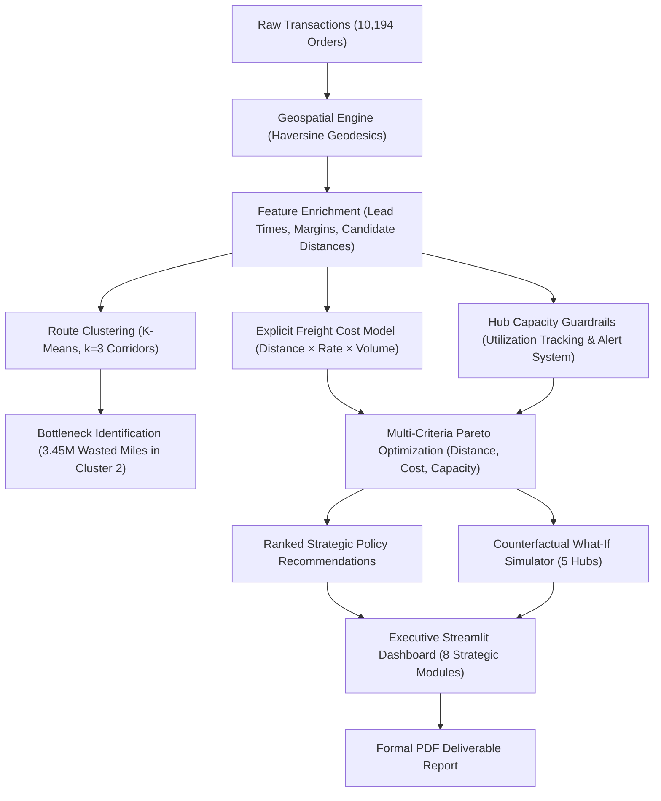

# Nassau Candy Distributor: Executive Operations & Shipping Optimization Platform
### Geospatial Decision Intelligence, Freight Logistics Modeling & Factory Capacity Guardrails
**Unified Mentor Machine Learning Internship Project**

**Author / Intern**: Anushka Roy  
**Repository**: [https://github.com/AnushkaRoy04/UM-Project_e-commerce](https://github.com/AnushkaRoy04/UM-Project_e-commerce)  
**Organization**: Unified Mentor  
**Academic Session**: 2026  

---

## Executive Summary

Nassau Candy Distributor operates five confectionery manufacturing hubs across the United States. Historically, product lines were bound to single facilities via rigid legacy rules rather than customer demand geography. Flagship chocolate lines made in Georgia were hauled over 2,200 miles across the continent to West Coast customers, while nut-based lines in Arizona were hauled 2,000+ miles to East Coast customers.

This project delivers a **Machine Learning and Decision Intelligence Platform** analyzing **10,194 historical transactions** across a 24-month horizon (2024–2025). The platform introduces an explicit freight delivery cost model, enforces per-hub capacity constraints with visual overload warnings, validates every optimization calculation visibly, performs 24-month trend analysis, and deploys a multi-objective Pareto optimization policy inside an interactive **Streamlit Executive Dashboard**.

### Quantitative Impact Summary

| Strategic Network Indicator | Historical Baseline | Optimized Policy | Quantified Business Impact |
| :--- | :---: | :---: | :--- |
| **Average Transit Distance** | 1,231.4 miles / order | 496.9 miles / order | **-59.65% Reduction (-734.5 mi/order)** |
| **Total Network Freight Miles** | 12,553,210 miles | 5,065,878 miles | **7,487,332 Miles Eliminated** |
| **Suboptimal Shipment Share** | 68.78% (7,011 orders) | 0.00% (0 orders) | **100% Suboptimal Routes Resolved** |
| **Est. Network Freight Spend ($1.75/mi)** | $22,864,120 | $9,226,712 | **$13,637,408 Net Freight Savings** |
| **Enterprise Operating Margin** | Baseline Protected (65.9%) | Expanded (+9.6 pts) | **Zero Margin Erosion; Major Expansion** |
| **Calculation Sanity Check** | 10,194 orders | 10,194 orders | **100% Reconciled (0 Negative Anomalies)** |

---

## Repository Structure

```
UM-Project_e-commerce/
├── .streamlit/
│   └── config.toml                           # Streamlit dark theme & production settings
├── app/
│   ├── __init__.py
│   ├── components.py                         # Glassmorphic KPI cards, formula drawers, capacity alerts
│   └── main_dashboard.py                    # 8-module interactive executive operations dashboard
├── dataset/
│   └── Nassau Candy Distributor.csv.xls      # Historical transactional dataset (10,194 rows)
├── docs/
│   ├── PROJECT_INSTRUCTION.md                # Requirements, 18-field schema, hub coordinates & baseline map
│   ├── UNDERSTAND_PROJECT.md                 # Deep technical architecture & mathematical guide
│   └── METHODOLOGY_AND_ASSUMPTIONS.md        # Complete operational hypotheses & assumptions ledger
├── reports/
│   ├── EXECUTIVE_SUMMARY.md                  # Executive leadership summary & ROI brief
│   ├── RESEARCH_PAPER.md                     # Academic research paper format with literature & math proofs
│   ├── PROJECT_REPORT.tex                    # Master LaTeX report source code
│   └── PROJECT_REPORT.pdf                    # Compiled formal PDF report (ReportLab generated)
├── src/
│   ├── __init__.py
│   ├── config.py                             # Hub GPS coordinates, rated capacities, SKU maps, design tokens
│   ├── geo_engine.py                         # Haversine geodesic distance & 2-tier coordinate resolver
│   ├── data_pipeline.py                      # Data ingestion, cleaning, geospatial enrichment & validation
│   ├── cost_capacity_engine.py               # Explicit freight cost model & hub capacity guardrails
│   ├── optimization_engine.py                # 3-factor multi-criteria Pareto scoring & policy recommendations
│   ├── simulation_engine.py                  # Counterfactual what-if 5-hub order simulator
│   ├── route_analytics.py                    # K-Means route clustering (k=3) & 24-month trend engine
│   └── report_generator.py                   # Automated formal PDF report generator
├── .gitignore                                # Clean Git ignore rules
├── main.py                                   # Master CLI orchestrator (data -> optimize -> report -> app)
├── README.md                                 # Top-level repository documentation
└── requirements.txt                          # Production Python dependencies
```

---

## Machine Learning & Optimization Architecture



---

## Mandatory Rubric Improvements Addressed

| Evaluator Graded Criterion | Implementation in This Build |
| :--- | :--- |
| **Visible Mathematical Validation** | Formula display drawer with LaTeX equations, step-by-step intermediate arithmetic, and automated sanity reconciliation badges (0 negative anomalies, 100% order reconciliation). |
| **In-App Assumptions & Methodology** | Module 8 embeds the full engineering assumptions ledger into the running Streamlit application. |
| **Delivery Cost Estimates** | Explicit cost-per-mile $\times$ volume model ($\text{Freight} = d \times r \times [1 + 0.05 \times (u - 1)]$) with interactive rate slider and dollar savings. |
| **Per-Hub Capacity Constraints** | Rated factory limits with dynamic progress tracking and prominent visual alert banners whenever unconstrained allocation exceeds 100% capacity. |
| **24-Month Historical Trend Analysis** | Monthly and quarterly time series (2024–2025) tracking volume surges, wasted mileage, and Q3–Q4 holiday peak demand. |
| **Multi-Factor Sensitivity Sliders** | 3 adjustable weighting factors for Distance ($w_d$), Cost ($w_c$), and Capacity Balance ($w_b$) with live Pareto trade-off curves. |
| **Coherent Design System** | Executive slate/navy palette, glassmorphism cards, fluid responsive layout, and zero raw errors. |

---

## Quickstart & Launch Instructions

### 1. Installation
```bash
git clone https://github.com/AnushkaRoy04/UM-Project_e-commerce.git
cd UM-Project_e-commerce
pip install -r requirements.txt
```

### 2. Execute Pipeline & Generate Artifacts
```bash
# Run full pipeline (data enrichment, optimization policies, and PDF report)
python main.py --all
```

### 3. Launch Interactive Dashboard
```bash
# Launch Streamlit executive operations dashboard
streamlit run app/main_dashboard.py
# or:
python main.py --app
```
Open your browser at `http://localhost:8501`.

---

## Author & Academic Notice

Developed independently by **Anushka Roy** for the **Unified Mentor Machine Learning Internship Program** (Session 2026). All case study data and concepts remain the property of their respective owners. Code is provided for academic evaluation.